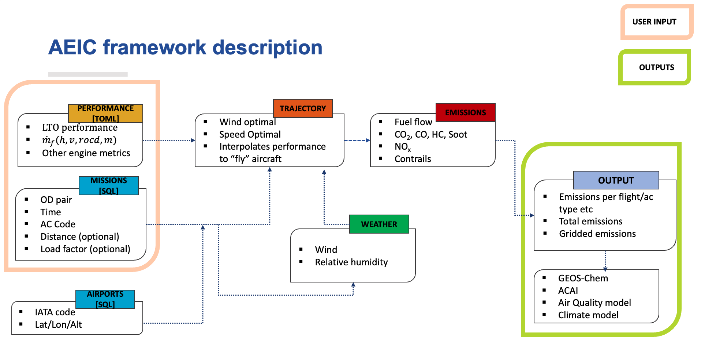

# AEIC Requirements Specification

*Version:* 0.2
*Date:* 2025-07-21

---

## 1. User Stories

| Name    | Narrative                                                                                                                                                                      | Key needs                                                    |
| ----- | ------------------------------------------------------------------------------------------------------------------------------------------------------------------------------ | ------------------------------------------------------------ |
| Aircraft emission analysis | Simulate a candidate aircraft to replace part or all of an existing fleet in order to quantify its emissions. | Loading OAG schedules for years, filtering them for a specific aircraft type or maximum range. Having detailed emissions outputs for AEIC run. |
| Aircraft Design | Run an annual global schedule multiple times with different performance models in order to analyse and trace emission impacts against design choices.                | Import performance models from external tools, run schedule at scale. Be able to save schedule/trajectories and run with different performance model.       |
| Environmental Impact | AEIC outputs are able to be inputs to GEOS‑Chem or ACAI so emissions can be translated into climate/AQ impacts.                                            | Scripts to get GEOS-Chem/ACAI suitable inputs. Gridding, summing etc.                            |
| Emission metrics analysis | Apply alternative emission metric/algorithms to a fixed set of trajectories in order to compare methodologies. | Caching trajectories and running different emissions modules to it |
| AEIC Developer | Comprehensive logging and a cache layer such that results are reproducible and debugging is easy. | Structured logs, cache directory API |

---

## 2. Technical Requirements

The following numbered technical requirements (TR‑IDs) derive directly from the user stories in Section 1. Each requirement is expressed in **“shall”** form and marked [H]igh or [M]edium.

### 2.1 Missions module

| ID       | Requirement                                                                                                                | Priority |
| -------- | -------------------------------------------------------------------------------------------------------------------------- | -------- |
| TR‑SCH‑1 | The module **shall** ingest OAG schedules in SQL format, process them to get aircraft type, load factor, datetime and airport pair.              | H        |
| TR‑SCH‑2 | The module **shall** allow filtering schedules by date range, airline, aircraft type, and route distance or maximum range. | H        |
| TR‑SCH‑3 | The module **should** persist filtered schedule subsets to avoid recomputation in later runs.                              | M        |

### 2.2 Performance Model

| ID        | Requirement                                                                                                                                                                       | Priority |
| --------- | --------------------------------------------------------------------------------------------------------------------------------------------------------------------------------- | -------- |
| TR‑PERF‑1 | The system **shall** accept performance models input as a TOML file defining fuel flow at different points specified by altitude, rate of climb/descent, mass, airspeed. | H        |
| TR‑PERF‑2 | The system **should** support batch execution across a schedule using multiple performance models.                                                                 | M        |

### 2.3 LTO datapoints

| ID        | Requirement                                                                                                                                                                       | Priority |
| --------- | --------------------------------------------------------------------------------------------------------------------------------------------------------------------------------- | -------- |
| TR‑EDB‑1 | The system **shall** accept an emissions databank (EDB) excel file as well as an engine UID in order to get LTO data points. | H        |
| TR‑EDB‑2 | The system **shall** also accept custom LTO data points within the performance model if the EDB is not needed to be used. | H        |

### 2.4 Trajectory Module

| ID        | Requirement                                                                                                           | Priority |
| --------- | --------------------------------------------------------------------------------------------------------------------- | -------- |
| TR‑TRAJ‑1 | The trajectory module **shall** produce 4‑D trajectories (lat, lon, alt, time elapsed) for every flight in the mission. | H        |
| TR‑TRAJ‑1 | The trajectory module **shall** metrics such as fuel flow, aircraft mass, etc. at each point in the trajectory | H        |
| TR‑TRAJ‑2 | The module **shall** cache trajectories keyed on aircraft type, airport pair, etc.      | M        |

### 2.5 Emissions Module

| ID       | Requirement                                                                                                     | Priority |
| -------- | --------------------------------------------------------------------------------------------------------------- | -------- |
| TR‑EMI‑1 | The emissions module **shall** compute emission indices and emissions in grams for $CO_2$, $H_2O$, $NO_x$, CO, HC, $SO_x$, $PM_{nvol}$, $PM_{vol}$ at every trajectory point. | H        |
| TR‑EMI‑2 | The module **should** support multiple algorithm variants (e.g., P3T3, BFFM2 for $NO_x$ calculations).                          | H        |
| TR‑EMI‑3 | The module **shall** aggregate emissions per flight, per aircraft type, and globally per species.                         | H        |

### 2.6 Post‑processing module

| ID       | Requirement                                                                                           | Priority |
| -------- | ----------------------------------------------------------------------------------------------------- | -------- |
| TR‑PPM‑1 | The post processing module **shall** grid emissions at user‑defined spatial resolution and temporal resolution (hourly). | H        |
| TR‑PPM‑2 | The module **shall** output NetCDF files with species names and units conforming to GEOS‑Chem & ACAI requirements.    | M        |
| TR‑PPM‑3 | The module **shall** include helper scripts to stage data for GEOS‑Chem, ACAI, etc.                                  | M        |

### 2.7 Logging and Developer tools

| ID       | Requirement                                                                                                | Priority |
| -------- | ---------------------------------------------------------------------------------------------------------- | -------- |
| TR‑LOG‑1 | All components **shall** emit structured logs with timestamp, run UUID and flight IDs where relevant. | M        |
| TR‑LOG‑2 | Each run **shall** print a configuration snapshot, and summarized outputs of trajectory and emissions modules. | M        |
| TR‑LOG‑3 | The system **should** capture runtime metrics and profiling for performance tuning.              | M        |

### 2.8 Documentation & Testing

| ID       | Requirement                                                                                                      | Priority |
| -------- | ---------------------------------------------------------------------------------------------------------------- | -------- |
| TR‑DOC‑1 | AEIC **shall** include proper documentation, user guides and example scripts covering each user story.                        | M        |
| TR‑DOC‑2 | Automated tests **shall** achieve ≥ 80 % code coverage, with a full test for a small schedule. | M        |

---

## 3. Framework

---

## 4. Inputs

| Source                               | Format                                      | Mandatory?                            | Key Fields / Sections                                                                                   |
| ------------------------------------ | ------------------------------------------- | ------------------------------------- | ------------------------------------------------------------------------------------------------------- |
| Performance model file              | **TOML**  `data/PerformanceModel/*.toml` | ✔                                     | `General_Information`, `Speeds`, `LTO_performance`, `flight_performance`                                |
| Missions / OAG Schedule                    | **SQL**               | ✔                                     | `dep_airport`, `arr_airport`, `dep_datetime`, `arr_datetime`, `great_circle_distance?`, `ac_code`, `load_factor?` |
| Airports database                    | **SQL**               | ✔                                     | `iata_code`, `lat`, `lon`, `altitude`                                                               |
| Configuration File              | **TOML** (`default_config.toml`)            | ✔                                     | `General Information`, `LTO data`, `Missions`, `Emissions`, `Output`                                    |
| Weather data  (ERA‑5, MERRA‑2 …) | **NetCDF‑4**                     | ✖ (falls back to standard atmosphere) | Winds: **u**, **v**, `relative_humidity`                                    |

> **?** means the field is optional

---

## 5. Modules & Intermediates

### 5.1 Trajectory Module

*For each mission* a *`Ntot`‑length* (total number of mission points) table **`trajectory_<FLIGHT_ID>`** is saved with columns:

| Column name                          | Description                  | Shape           |
| ----------------------------------------- | --------------------------- | --------------- |
| `fuelFlow`                        | Total fuel flow rate [`kg/s`] | (Ntot,) |
| `acMass`                   | Total mass of aircraft over the trajectory [`kg`]       | (Ntot,) |
| `fuelMass` | Mass of fuel over the trajectory [`kg`]    | (Ntot,)    |
| `groundDist` | Cumulative ground distance covered [`m`]    | (Ntot,)    |
| `altitude` | Altitude [`m`]    | (Ntot,)    |
| `FLs` | Altitude in flight levels [ ]    | (Ntot,)    |
| `rocs` | Rate of climb (negative for rate of descent) [`m/s`]    | (Ntot,)    |
| `flightTime` | Elapsed flight time [`s`]    | (Ntot,)    |
| `latitude` | Latitude at mission point [`degrees`]    | (Ntot,)    |
| `longitude` | Longitude at mission point [`degrees`]    | (Ntot,)    |
| `azimuth` | Azimuth to arrival airport [`degrees`]    | (Ntot,)    |
| `heading` | Heading at mission point  [`degrees`]    | (Ntot,)    |
| `tas` | True airspeed  [`m/s`]    | (Ntot,)    |
| `groundSpeed` | Ground speed  [`m/s`]    | (Ntot,)    |
| `FL_weight` | weighting used in linear interpolation over flight levels  [ ]    | (Ntot,)    |

### 5.2 Weather Module

The trajectory table is extended in‑place with:

| Field               | Unit  |
| ------------------- | ----- |
| `wind_u`, `wind_v`  | m s⁻¹ |
| `relative_humidity` |       |

### 5.3 Emissions Module

For each mission the module stores **`emissions_<FLIGHT_ID>`** containing:

| Column name                          | Description                  | Shape           |
| ----------------------------------------- | --------------------------- | --------------- |
| `emission_indices`                        | EI by species at each point in trajectory | (Ntot, species) |
| `pointwise_emissions_g`                   | Emissions in grams at each point in trajectory       | (Ntot, species) |
| `LTO_emission_indices`, `LTO_emissions_g` | LTO emission indices or emission in grams    | (4, species)    |
| `APU_emission_indices`, `APU_emissions_g` | APU emission indices or emission in grams              | (1, species)    |
| `GSE_emissions_g`                         | Ground‑support equipment    | (1, species)    |
| `summed_emission_g`                       | Flight total summed emissions (trajectory+LTO+APU+GSE+Lifecycle)                | (species,)      |

Each of the above data points have columns (`n` = number of points):

| Column name                           | Shape           |
| --------------------------- | --------------- |
| `CO2`                        | (n,) |
| `HC`                        | (n,) |
| `CO`                        | (n,) |
| `NOx`                        | (n,) |
| `NO`                        | (n,) |
| `NO2`                        | (n,) |
| `HONO`                        | (n,) |
| `PMnvol`                        | (n,) |
| `PMnvol_lo`                        | (n,) |
| `PMnvol_hi`                        | (n,) |
| `PMnvolN`                        | (n,) |
| `PMnvolN_lo`                        | (n,) |
| `PMnvolN_hi`                        | (n,) |
| `PMnvolN_GMD`                        | (n,) |
| `PMvol`                        | (n,) |
| `OCic`                        | (n,) |
| `SO2`                        | (n,) |
| `SO4`                        | (n,) |

The emissions module also calculates a total fuel burn from trajectory, APU, GSE and LTO.

> **NOTE:** $CO_2$, $H_2O$ and $SO_2$, $SO_4$ are scalar products of fuel burn and   need not be saved in intermediate outputs since they can be computed easily.

### 6. Output Module

| ID     | Artifact               | Format                                                                                   | Granularity                     |
| ------ | ---------------------- | ---------------------------------------------------------------------------------------- | ------------------------------- |
| **O1** | Emissions by flight/aircraft type |**NetCDF‑4** (`by_flight_emissions_YYYYMM.nc`)                                                                            | 1 row per flight                |
| **O2** | Total summed emissions         | **NetCDF‑4** (`summed_emissions_YYYYMM.nc`)                                                                              | (species, total\_kg) |
| Gridded emissions  | **NetCDF‑4** (`gridded_emissions_YYYYMM.nc`)                                                     | lon × lat × alt × time x species      |
| Model‑specific exports | Files as required by  **GEOS‑Chem**, **ACAI**, other AQ/climate models | varies                          |

---

## 7. Nomenclature

| Term               | Meaning                                               |
| ------------------ | ----------------------------------------------------- |
| **LTO**            | Landing & Take‑Off cycle (≤ 3000 ft)                  |
| **APU**            | Auxiliary Power Unit                                  |
| **GSE**            | Ground Support Equipment                              |
| **EI**             | Emission Index, g pollutant per kg fuel               |
